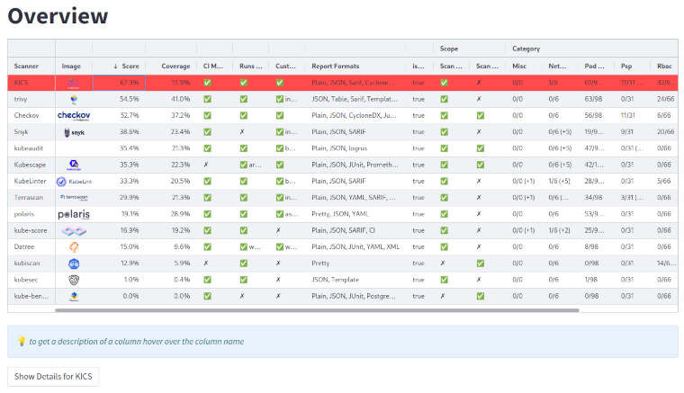
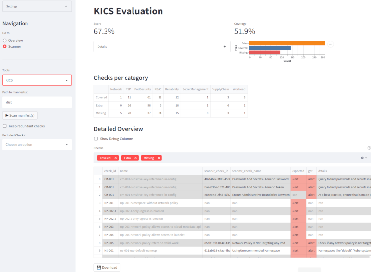
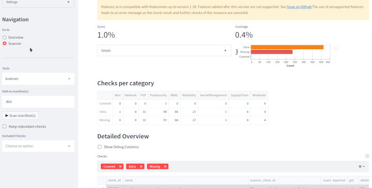

<!-- markdownlint-disable MD040 MD059 -->
# 📊 Kalm Benchmark

The goal of the Kalm benchmark is to provide a proper baseline for comparing Kubernetes (workload) compliance/misconfiguration scanners.  
This benchmark consists of two parts:

- a set of manifests, which contain misconfigurations, which scanners should detect
- a web UI to help with the comparison and analysis of the scanner results on this benchmark

| ⚠️ This product is not officially supported by Dynatrace. |
| --------------------------------------------------------- |

## Description

### Benchmark Manifests

To facilitate a fair comparison, a set of manifests is generated.
By design the generated manifests follow all the best practices.
A single manifest is supposed to trigger a single check of the scanner.
The ID and further information for the check are provided as labels and annotations on the generated resources.

This way, it is easy to compare the expected results with the actual results of a scanner.
An overview of all the checks in the benchmark can be found in [Benchmark Checks](./docs/benchmark-checks.md).

### Web UI

The web application consists of two pages:

- an overview of various scanners checked with this benchmark  
   
- an analysis page to inspect the results of a specific scanner in more detail  
   

## Use-Cases

- for Security and Ops teams:
  - find a suitable scanner for your needs
  - aids you in the development of your custom checks/policies/queries/rules for a tool

- For scanner developers
  - compare your tool to alternatives on the market
  - develop and maintain your implemented checks, e.g.:
    - identify noisy checks (e.g., multiple checks which raise an alert for the same issue)
    - or faulty checks (e.g., alerts which were erroneously raised or not raised due to a bug)
      

## Prerequisites

- Python >= 3.9
- The manifests are generated using [cdk8s](https://cdk8s.io/), which depends on **[nodeJS](https://nodejs.org/en/)**
  - Please ensure **nodeJS** is installed on your system
- Any **scanner** for which a scan should be triggered must be installed manually
- [Poetry](https://python-poetry.org) is used to manage the project itself

## Getting Started

### 1) 🔨 Installation

To install the benchmark along with its dependencies listed in the `pyproject.toml` execute:

```shell
poetry install
```

### 2) 🏄‍♀️ Usage

To use this package run the CLI with the appropriate command:

```shell
poetry run cli <command>
```

For detailed information of the available commands or general help run:

```shell
poetry run cli --help
```

#### 2.1) Generating manifests

To generate manifests use the `generate` command:

```shell
poetry run cli generate [--out <target directory>]
```

These manifests form the basis for the benchmark and will be placed in the directory specified with the `--out` argument. The location defaults to the `manifests` folder in the working directory.

#### 2.2) Start the Web UI

Besides the CLI commands the tool also provides a web user interface to manage the scan(s) and analyse evaluation results. It can be started with the command:

```shell
poetry run cli serve
```

#### 2.3) Perform a scan with a Scanner

To scan either a cluster or manifest files with the specified tool use the `scan` command.
Use either the `-c` flag to specify the target cluster or the `-f` flag to specify the target file/folder.  

```shell
poetry run cli scan <tool> [-c | -f <target file or folder>]
```

❗️ **Important** executing a scan requires the respective tool to be installed on the system!

E.g., to scan manifests with the tool `dummy` located in the `manifests` folder execute:

```shell
poetry run cli scan dummy -f manifests
```

In order to save the results, add the `-o` flag with the name of the destination folder:

```shell
poetry run cli scan <tool> [-c | -f <target file or folder>] -o <output-folder>
```

#### 2.4) Evaluate a Scanner

For the evaluation of a scanner the tool must be run beforehand and the results must be stored as `<tool>_v<version>_<yyyy-mm-dd>.json`.
Then the stored results can be loaded by the tool for the evaulation.

```shell
poetry run cli evaluate <tool>
```

## 🚀 Deployment

Some scanners only scan resources deployed in a Kubernetes cluster.
You can find instructions on how to deploy the benchmark in a cluster [here](./docs/deployment.md)

## Tool-specific considerations

### kube-bench

As their description states, it focuses on **infrastructure security** and not **workload security**:
> Checks whether Kubernetes is deployed according to security best practices as defined in the CIS Kubernetes Benchmark.

Thus, the tool is listed in the benchmark just for completness sake and is expected to perform poorly because it focuses on another domain, than what is covered by this benchmark!

#### KubiScan

KubiScan is not formally installed on a system. Instead, the project can be cloned and executed as Python script.
For a consistent interface, the benchmark assumes to that KubiScan can be called directly using the alias `kubiscan`
E.g. to use a dedicated virtual environment (called `venv` inside the kubiscan directory) you can create the alias in Linux using this command

```
alias kubiscan="<PATH-TO-DIR>/venv/bin/python <PATH-TO-DIR>/KubiScan.py"
```

## Troubleshooting

### The results from `docker run` can't be parsed

- ensure the `-t` flag is not used in the command. If it is, `stdout` and `stderr` are joined to just `stdout`. This means errors can't be handled properly and it corrupts the results in `stdout`.

## 💪 Contributing

Want to contribute? Awesome! We welcome contributions of all kinds: new scanners, fixes to the existing implementations, bug reports, and feedback of any kind.

- See the contributing guide [here](./CONTRIBUTING.md).
- Guidelines on how to onboard a new scanner can be found in the [Scanner Onboarding Guide](./docs/scanner_onboarding_guide.md)
- Check out the [Development Guide](./docs/dev_guide.md) for more information.
- By contributing you agree to abide by the [Code of Conduct](./CODE_OF_CONDUCT.md).

---

## License

[Apache Version 2.0](./LICENSE)
