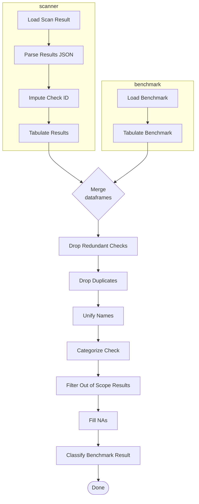

<!-- markdownlint-disable MD040 -->
# Dev Guide

## 1) Overview

Directory Structure

```
.
├── data                                # directory with scanner results
│
├── kalm_benchmark                      # source code of the package
│   ├── cli.py                          # Command line interface
│   ├── evaluation                      # module for evaluation the scanner results
│   │   ├── scanner                     # module containing dedicated scripts per scanner for parsing its results
│   │   │   ├── ...
│   │   │   └── scanner_evaluator.py    # the base for the scanner specific scripts
│   │   ├── ccss/                       # CCSS functionality module
│   │   │   ├── ccss_models.py          # CCSS data models and structures
│   │   │   ├── ccss_database.py        # CCSS database operations
│   │   │   ├── ccss_service.py         # high-level CCSS service interface
│   │   │   └── ccss_converter.py       # converter between existing and CCSS formats
│   │   ├── database.py                 # unified SQLite database for all KALM data
│   │   ├── service.py                  # unified service interface replacing file-based storage
│   │   ├── evaluation.py               # the core of the evaluation module
│   │   ├── scanner_manager.py          # scanner discovery and management
│   │   ├── file_index.py               # manifest file indexing
│   │   └── utils.py                    # evaluation utility functions
│   ├── manifest_generator              # module for generating the benchmark manifests
│   │   ├── cdk8s_imports               # (generated) imports of k8s definitions generated by cdk8s
│   │   ├── constants.py                # collection of constants shared across manifests
│   │   ├── gen_manifests.py            # entry-point for generating the manifests
│   │   ├── ...
│   │   └── workload                    # definition of workload related manifests
│   └── ui                              # module for the visualization of the evaluation
│       ├── analytics/                  # analytics utilities and data processing
│       │   ├── coverage_utils.py       # coverage analysis utilities
│       │   ├── helm_analytics.py       # helm chart analysis functions
│       │   ├── historical_analysis.py  # time-series and trend analysis
│       │   ├── performance_utils.py    # scanner performance metrics
│       │   └── scanner_evaluation.py   # evaluation and comparison logic
│       ├── interface/                  # UI interface utilities
│       │   ├── gen_utils.py            # general UI utility functions
│       │   ├── overview_utils.py       # overview page utilities
│       │   ├── scanner_ui.py           # scanner interface components
│       │   └── source_filter.py        # data filtering components
│       ├── modules/                    # modular UI pages
│       │   ├── benchmark_comparison.py # benchmark comparison module
│       │   ├── benchmark_scanner.py    # scanner benchmarking module
│       │   ├── ccss_overview.py        # CCSS alignment analysis
│       │   ├── helm_scanner_analysis.py # helm scanner analysis
│       │   ├── helm_security_trends.py # helm security trend analysis
│       │   └── overview.py             # main overview module
│       ├── scanner_details/            # scanner-specific UI components
│       ├── visualization/              # charting and visualization utilities
│       │   ├── chart_utils.py          # chart generation and styling
│       │   └── icon_utils.py           # scanner icons and visual elements
│       ├── app.py                      # main Streamlit application entry point
│       ├── components.py               # reusable UI components
│       ├── data_processing.py          # UI data processing utilities
│       ├── logging_config.py           # centralized logging configuration
│       └── utils/                      # UI utility modules (migrated from old location)
│
├── manifests                                # (generated) the target directory for generated manifests
├── notebooks                           # folder containing all notebooks used for the analysis
│── tests                               # all unit-tests mirroring source code structure
└── tox.ini                             # tox file with settings for flake8 and running tox
```

The project consists of 3 main modules:

- `manifest_generator`: the code for the generation and management of the manifests for the benchmark
- `evaluation`: contains all the code for scanners and their evaluations, including CCSS integration
- `ui`: the web interface for visualization and analysis, including CCSS alignment views

### CCSS Module Components

The evaluation module includes CCSS (Common Configuration Scoring System) functionality and unified data storage:

- `database.py`: Unified SQLite database for all scanner results and CCSS data
- `service.py`: High-level service interface replacing file-based storage
- `ccss/ccss_models.py`: Data models for CCSS findings and alignment analysis
- `ccss/ccss_database.py`: CCSS-specific database operations (integrated with unified DB)
- `ccss/ccss_service.py`: High-level service interface for CCSS operations
- `ccss/ccss_converter.py`: Conversion utilities between existing and CCSS data formats

### Unified Database Storage  

The benchmark uses a unified SQLite database instead of file-based storage:

- **Performance**: Database queries replace file system operations
- **CCSS Integration**: Native support for CCSS scoring and alignment analysis
- **Unified Storage**: All scanner results, evaluations, and CCSS data in one database
- **Historical Tracking**: Complete audit trail of all scan runs and evaluations  

## Setup

### 1) Installation

To install the project and all the dependencies execute:

```shell
poetry run install
```

After the installation the pre-commit hooks must be installed:

```shell
poetry run pre-commit install
```

This installs the following tools with minor adjustments:

- [black](https://black.readthedocs.io/en/stable/) to format the code
- [flake8](https://flake8.pycqa.org/en/latest/) to lint the code
- [isort](https://pycqa.github.io/isort/) to sort the import statements

### 2) Dependency management

[Poetry](https://python-poetry.org) is used for the management of this project.
Thus, to install new dependency also use poetry instead of pip:

```shell
poetry add <dependency>
```

### 3) Run Tests

For unit-tests [pytest](https://docs.pytest.org/en/) is used. To run all tests enter:

```shell
poetry run pytest
```

## Evaluation pipeline

The evaluation of the scanner results run through a unified pipeline.
At the beginning the results of a scanner are loaded and parsed. These steps are specified to every scanner and can be customized in the respective implementation.
Afterwardse, the results are structured as a table and any missing check ids are imputed.
In parallel, the benchmark table is created by implicetely generating the manifests using [cdk8s](https://cdk8s.io/docs/latest/).

Both tables are merged on their `check_id` column and the respective column containing information of the `checked path`.
Finally, the outcome is post-processed by removing duplicates and missing values and categorizing the checks.

The full pipeline is as follows:



## UI Development & Troubleshooting

### Recent UI Architecture Changes

The UI structure has been reorganized for better maintainability:

- **`_pages/`**: Internal page logic modules (backend processing)
- **`pages/`**: Streamlit page files (frontend UI)
- **`utils/`**: Utility modules (migrated from old `ui/utils/` location)

### Common UI Issues & Fixes

**Data Loading Issues**:

- **Problem**: "'int' object has no attribute 'get'" errors
- **Cause**: Mixed data types in database summaries (integers vs dictionaries)
- **Solution**: Implemented robust type checking in `_get_category_ratio()` and `_safe_merge_categories()`

**Column Name Mismatches**:

- **Problem**: UI not displaying data despite database containing results
- **Cause**: UI code looking for capitalized column names ('Score', 'Coverage') while DataFrame uses lowercase ('score', 'coverage')
- **Solution**: Implemented proper column mapping system in benchmark overview page

**Helm Chart Detection**:

- **Problem**: "No Helm chart scan data available" despite having data
- **Cause**: Incorrect filtering logic not recognizing `helm-chart:` prefix
- **Solution**: Updated `get_available_helm_charts()` to properly parse `source_type` field

### Testing UI Changes

Always run comprehensive tests after UI modifications:

```bash
# Run all UI tests
poetry run pytest tests/ui/ -v

# Run specific test categories  
poetry run pytest tests/ui/test_overview_fixes.py -v
poetry run pytest tests/ui/test_helm_scanner_analysis_fixes.py -v
poetry run pytest tests/ui/test_security_trends_fixes.py -v

# Run full evaluation tests to ensure no regressions
poetry run pytest tests/evaluation/ --maxfail=5
```

### Debugging UI Issues

1. **Check logs**: UI actions are logged in `logs/ui_YYYYMMDD.log`
2. **Enable debug mode**: Add debugging code to see data structures:

   ```python
   st.code(f"DataFrame columns: {df.columns.tolist()}")
   st.code(f"DataFrame shape: {df.shape}")
   st.code(f"First row: {df.iloc[0].to_dict() if not df.empty else 'Empty'}")
   ```

3. **Database inspection**: Use `poetry run cli db-stats` to check database content
